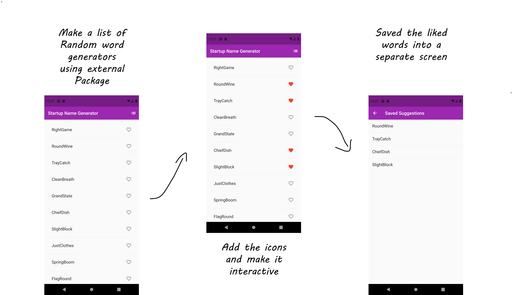

# labtask

A new Flutter project.

## Getting Started
In this task I have tried making a list view (using a list view builder) of the english_words pairs. Then I have added icons to the list view and made it interactive in the final phase I implemented screen navigation to the screen where the liked items from the listview shall be added.

